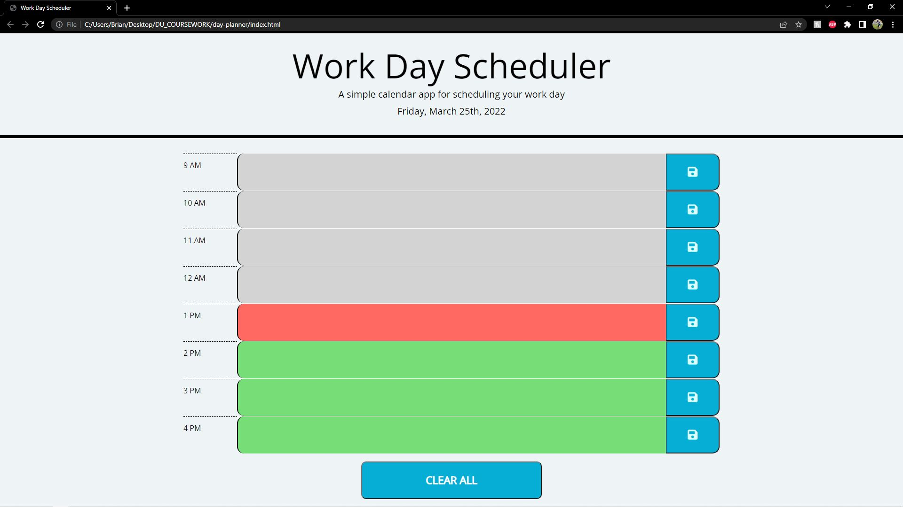
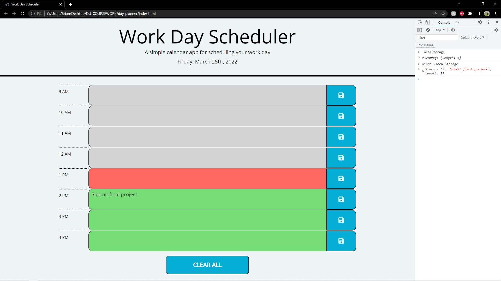

# Simple Day Planner project

## This application uses jQuery and MomentJS to create a real-time day planner.

Final application allows user to click into textarea elements to enter a task for that given time block. Blocks are color coded to indicate past(grey), present (red), and future (green). If the save button is clicked, the text for that time block will be committed to localStorage and saved for later visits to the page. When the page is reloaded, anything in localStorage will be displayed in the appropriate time blocks.

### Accessibility features

- Tab index prioritizes time blocks for easy keyboard navigation.
- App allows user to use either button or Enter key to save a task.
- "CLEAR ALL" button added to bottom to wipe the planner of its contents.

